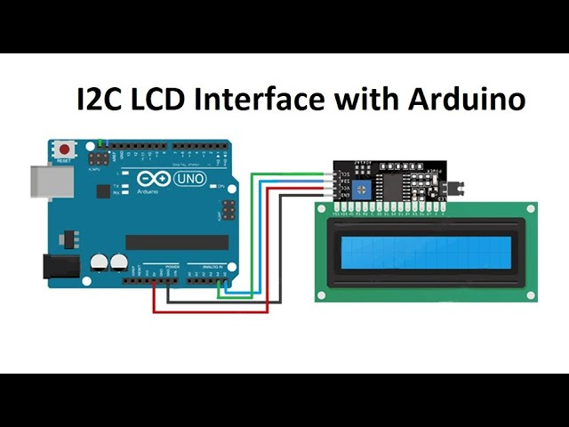

# Connect hardware

This is docs support for you connect hardware. Currently framework will decision you need use what's number pin, so you can not change pin mode on current. But in the future it will be to that.

## LED
- Prepare:
        - Registor value 1000
        - Arduino Uno / Arduino Nano / Arduino Mega / Esp32 / ESP8266

## LCD1602
- Prepare:
        - LCD 1602
        - IC2
        - Arduino Uno / Arduino Nano / Arduino Mega / Esp32 / ESP8266

