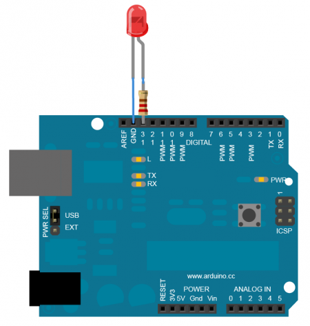

# php-PIOT
This is a framework support for you control to electronic board as Uno, Esp32, Esp8266, Atmega2560 ...etc

## Support features
        | Feature      | Status   |
        |--------------|----------|
        | LED          | ✔        | 
        | LCD 1620     | X        |
        | LCD 1604     | X        |    
        | LCD OLED     | X        |  
        | SD Card      | X        |    
        | OV2640       | X        |     
        | L293D        | X        |     
        | L293D        | X        |     
        | Arduino CNC  | X        |
        | Shield V3    |          |
        | ESP8266      | X        |
        | ESP32        | X        |
        | 8 joint      | X        | 
        | robot arm    |          |

## How to install? 
First you need connect your electronic board by USB. After you need check what's number COM?
Next step you need download this repo and try control led feature.

    ```
        <?php 
        require_once __DIR__ . '/Defines/pinMode.php';
        require_once __DIR__ . '/Adapters/USBConnecting.php';
        require_once __DIR__ . '/Hardware/HardwareFactory.php';
        use PIOT\USBConnecting\USBConnectingFactory;
        use PIOT\Hardware\Factory\HardwareFactory;

        try {
            $usbFactory = new USBConnectingFactory();
            $connect = $usbFactory->create(true);
            $connect->setSerial(3);
            $connect->setBAUD(9600);
            $connect->setReceiveDelay(3);

            $hardwareFactory = new HardwareFactory();
            $lcd = $hardwareFactory->createLCD1602();
            $lcd->high();
            $connect->setMessage($lcd->displayText("Current time: ",true,0));
            $connect->send();
            echo $connect->receive() . ' | ';
            $connect->setMessage($lcd->displayText(date('Y-m-d H:i:s',time()),false,0));
            $connect->send();
            echo $connect->receive() . ' | ';

        }catch(\Exception $e) {
            echo "ERRORS: " . $e->getMessage();
        }
    ```

Hardware 

 

View full at here: https://github.com/steveleetn91/php-PIOT/tree/dev/Hardware/README.md 

## RUN

        php ./index.php

## Hardware 
Visi here https://github.com/steveleetn91/piot